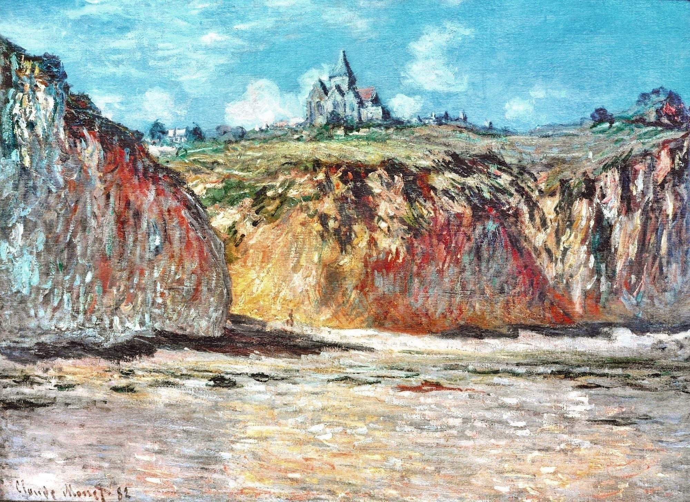
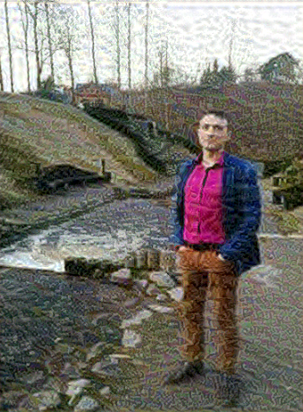
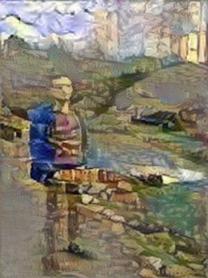
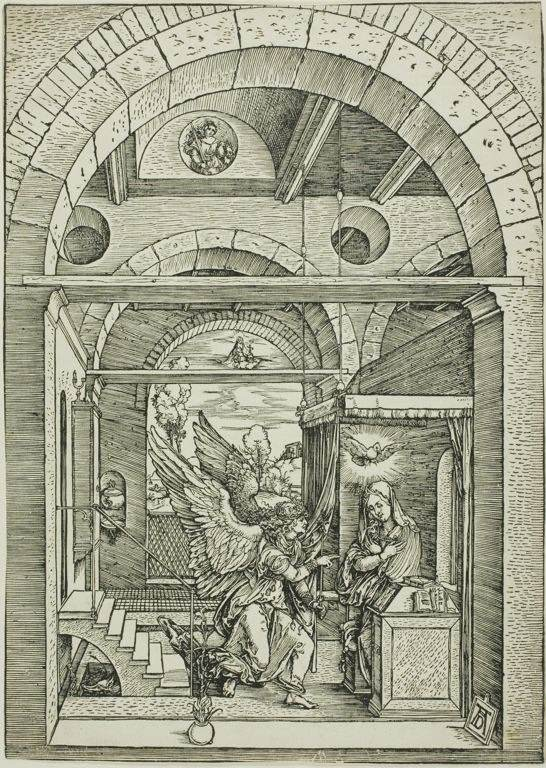
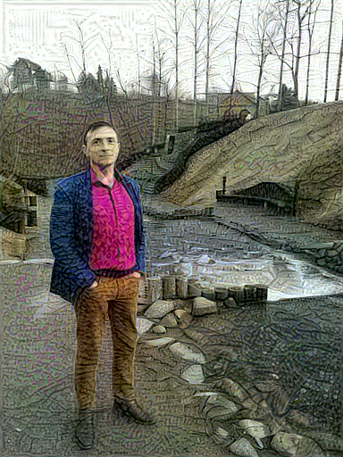
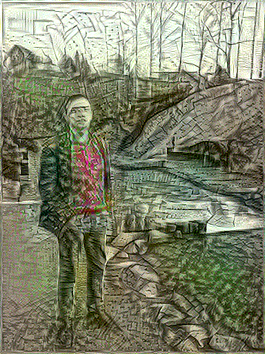

# Image style transfer

### About
This project is a Python script for transferring the rendered style from one image to 
another and moving the rendering to HTML for integration into any type of website. 
The script defines several functions for loading and processing images, 
defining style and content layers, creating a style transfer model, calculating loss, 
and optimizing the generated image. This script is a convenient way to transfer style 
using the VGG19 model and TensorFlow. To use this script, you can provide content and 
style image paths, specify the desired number of epochs.

I have attached two examples: 
examples 1: 
I choose a photo and a picture, according to which the style of the photo will be made 

 
I am attaching examples with different epoch choices for 10, 100 and 500 epochs 
 
 

examples 2: 
I choose a photo and a picture, according to which the style of the photo will be made 

 
I am attaching examples with different epoch choices for 10, 100 and 500 epochs 

 

### Introduction

### Startup procedure
